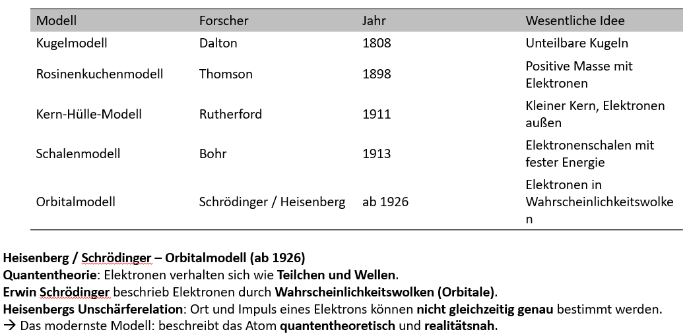

# Atommodelle

1.  Schalenmodell

2.  Rosinenkuchenmodell

3.  Orbital modell

- Rutherfordsche Streu Versuch

- Linien Spektren von Atomen

- Elektronen brauchen Energie um angeregt zu werden
  - Spezifische, feste Energie Spektren

- Flamm Färbungs Experimente → Elemente aufgrund von Farbe identifiziern

## Siehe auch

- [[Das PSE]]
- [[Orbital Modell]]
- [[Stabile Elemente & OktettRegel]]
- [[Radioatkiver Zerfall]]
