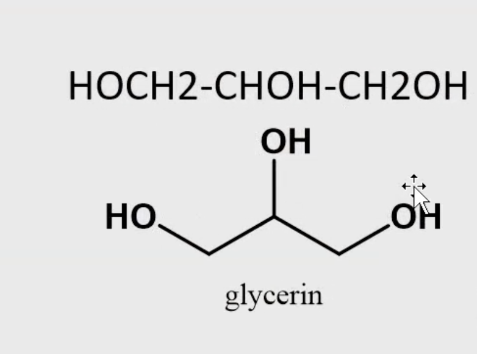
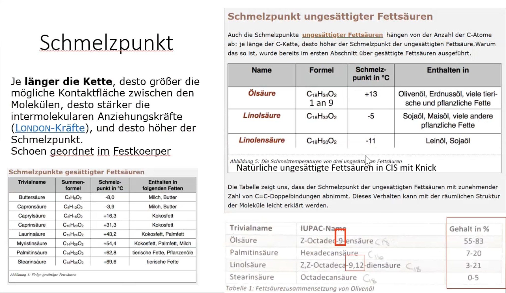
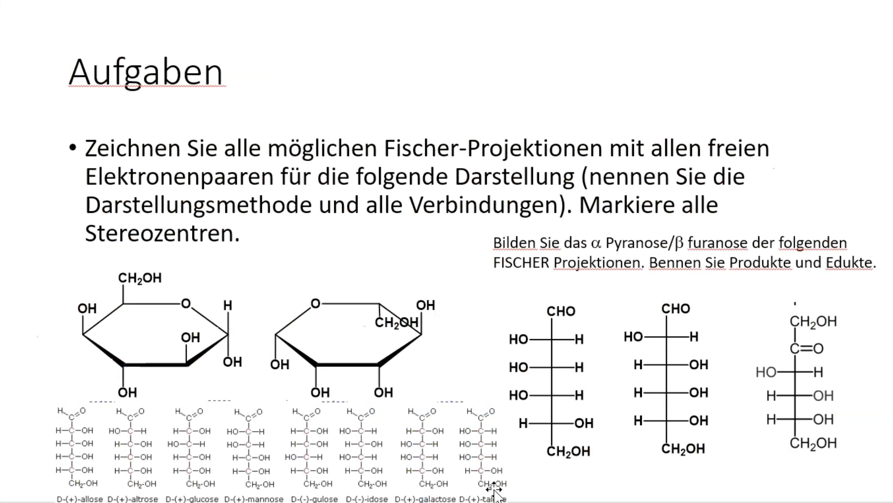
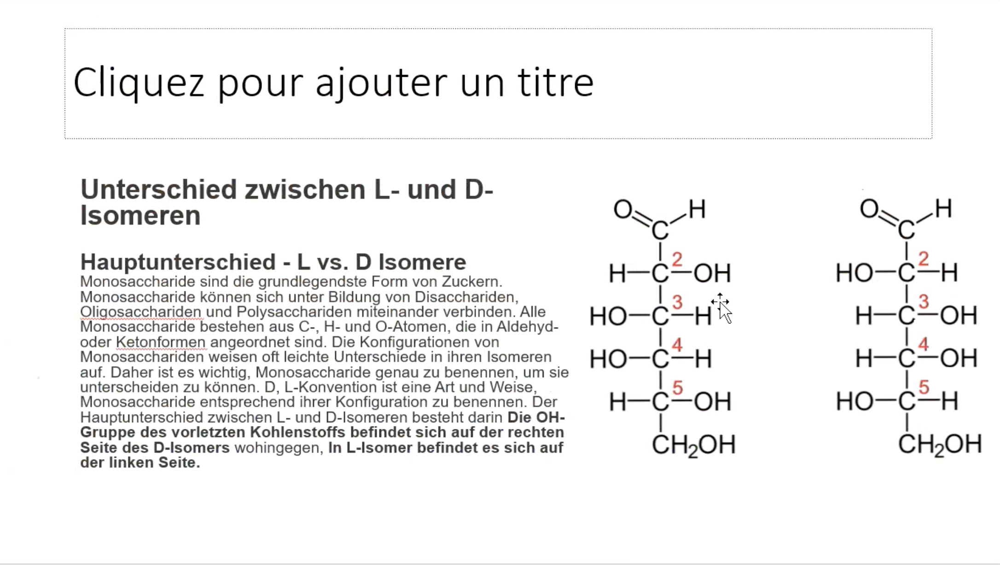
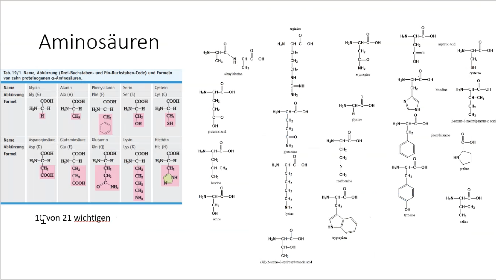
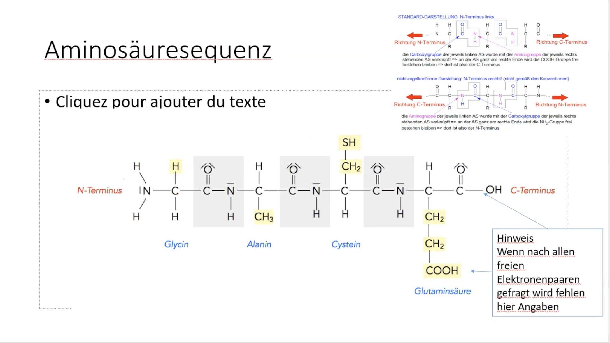
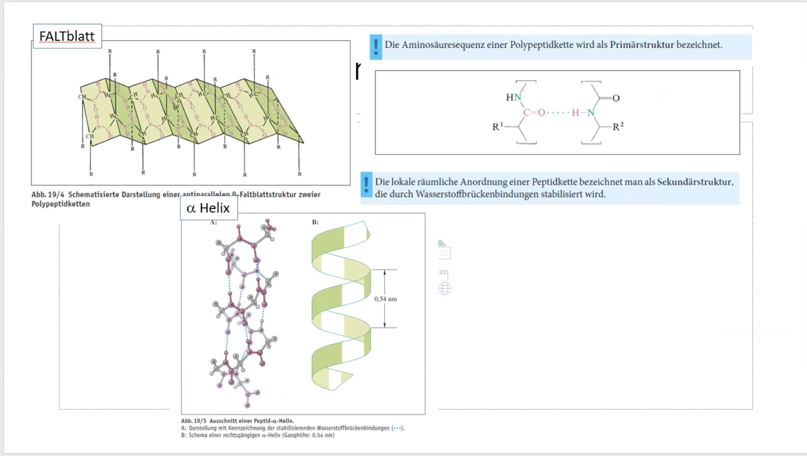
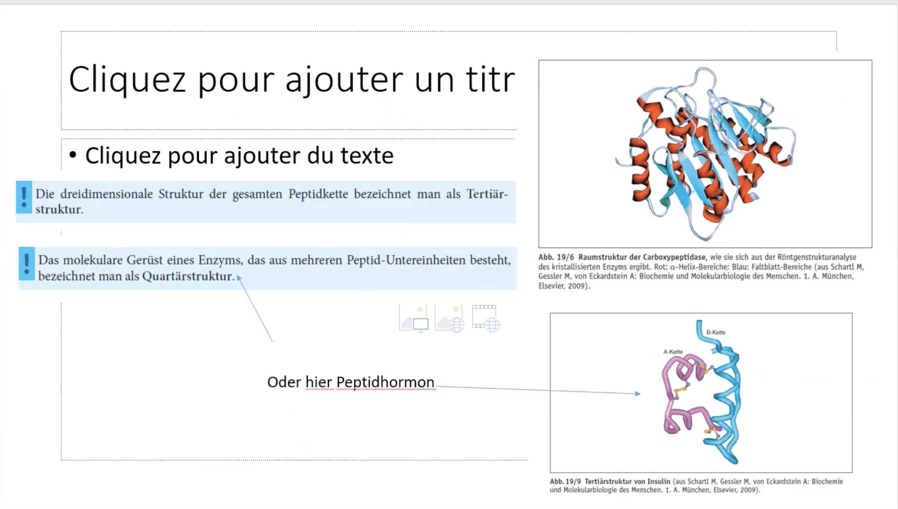
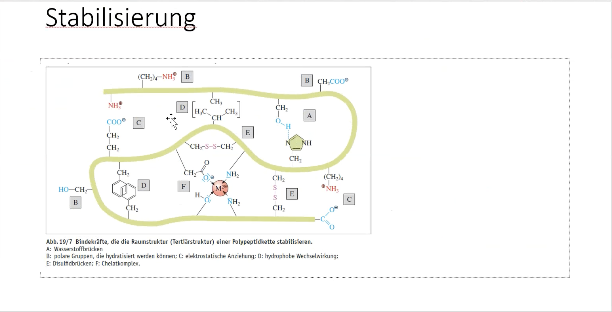
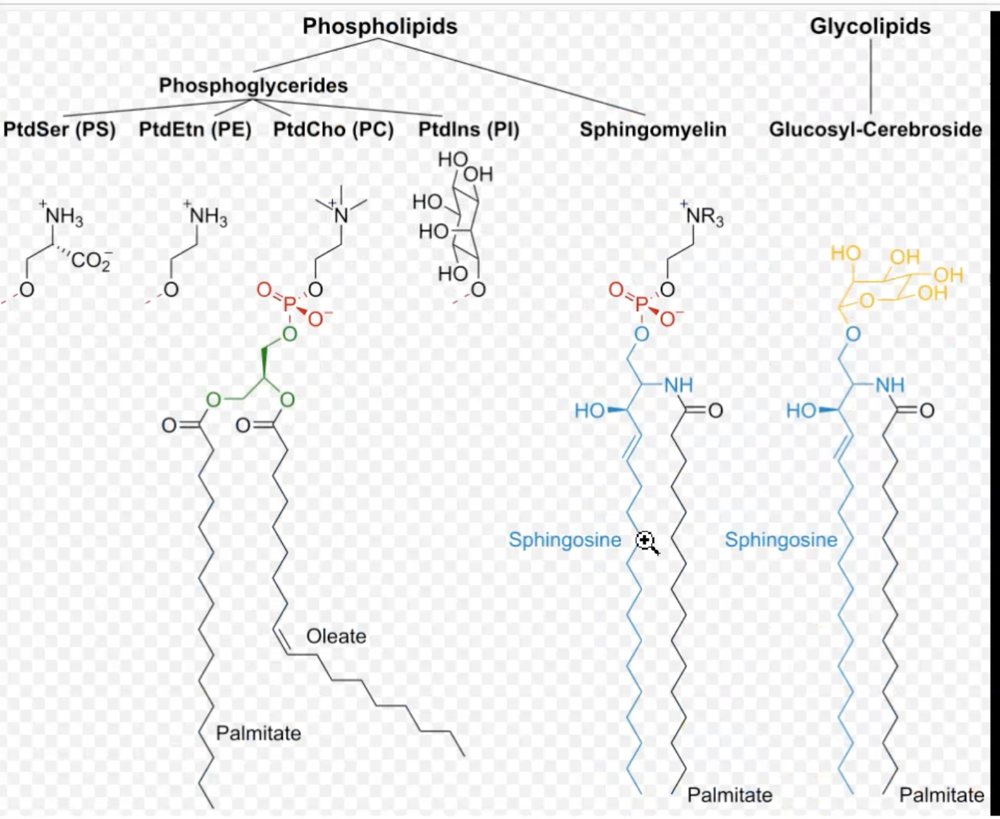

# Fette, Zucker, Aminosäuren, Peptide

## Schmelzpunkt

Fette spalten : Abmachen des Glycerins

## Zucker

## Fischer-Projektion

4 verschiedene Substituenten

Polysacharid && Glucose

## Aminosäuren - Bausteine der Peptide

Peptide sind Aminosäuren

Es gibt ungefähr 21 Aminosäuren

## Alpha Helix oder Beta Faltblatt

## Stabilisierung

## Siehe auch

- [[Biochemie]]
- [[Molekulare Strukturen und Bindungen]]
- [[Stöchiometrie und nukleophile Substitution]]
- [[Proteinbiosynthese]]
