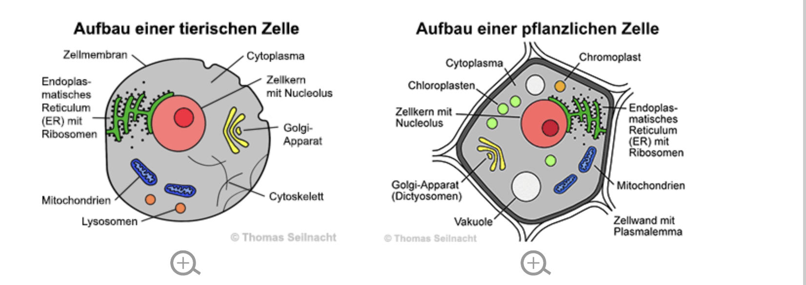
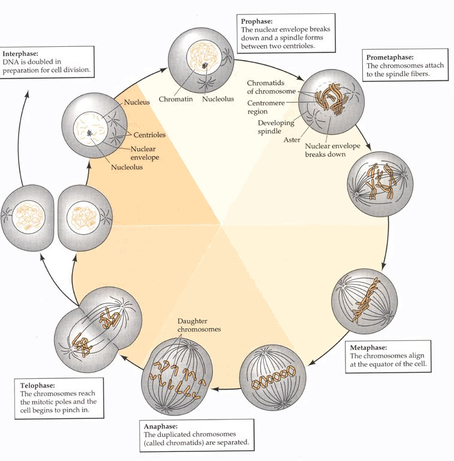

# Zelle - Pflanze & Tier

<https://www.digitalefolien.de/biologie/pflanzen/aufbau/zell.html>

### Unterschiede zwischen pflanzlichen und tierischen Zellen

- Pflanzenzellen besitzen zusätzlich Zellwand, Chloroplasten (Photosynthese) und große Vakuole.

- Tierische Zellen haben keine Zellwand und keine Chloroplasten, besitzen dafür Lysosomen.

> 💡
>
> the Mitochondria is the powerhouse of the cell  
> Aus diesem Kommt Energiegewinnung

### Bestandteile von Zellen

- **Zellkern:** Steuerzentrale der Zelle, enthält die DNA, kontrolliert Zellaktivitäten und die Zellteilung

- **Mitochondrien** : Produzieren Energie durch Zellatmung

- **Ribosomen :** Orte der Proteinsynthese, übersetzen **mRNA in Proteine**

- **Golgi-Apparat:** Verpackt und modifiziert Proteine und Lipide, bereitet den Export vor.

- **Lysosomen:** Verdauen Abfallstoffe und Zellreste (in tierischen Zellen).

- **Chloroplasten:** Nur in Pflanzenzellen, führen Photosynthese durch und erzeugen Glukose.

- **Zellmembran:** Abgrenzung der Zelle, reguliert Stoffaustausch.

- **Zellwand:** Nur in Pflanzenzellen, gibt Form und Stabilität.

### Visikel

## Siehe auch

- [[Biochemie]]
- [[Proteinbiosynthese]]
- [[Immunbiologie]]
- [[Vererbungslehre]]

Visikel werden von dem Golgi Apparat ausgeschleust

- Vereinen sich mit der Zellwand, was im Visikel enthalten ist, wird nach außen geschleust.

### Zellteilung

Die Zellteilung erfolgtin zwei Formen :

### Mitose - Kernteilung

- Erhaltung des Erbgutes

- Interphase, Prophase, Metaphase, Anaphase, Telophase, Cytokinese

<https://www.digitalefolien.de/biologie/pflanzen/aufbau/zell.html>

## Zellmemebran

Doppelte Lipidschicht

Bei einer Pflanze ist die Zellwand aus Cellulose (Gerüst)
