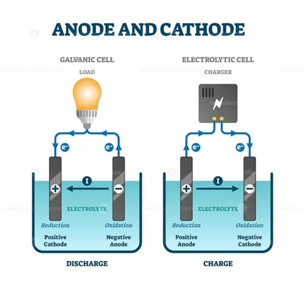

# Elektrochemie

> 💡
>
> Elektrochemie befasst sich mit den chemischen `Reaktionen`, die Elektrizität erzeugen oder durch Elektrizität angetrieben werden.  
> Beispiele können Batterien oder Akkus sein
>
> Elektrolyse
>
>   



# Redox Reaktionen - 2 Reaktionen

Redox setzt sich aus zwei Teilen Zusammen :

- einer Reduktion `(Elektronen e- werden aufgenommen)`

- einer Oxidation `(Elektronen e- werden abgegeben)`

Elektronenübergabe immer gekoppelt : Ein Partner oxodiert, der andere reduziert.

> 💡
>
> Wichtig : Diese Zwei Reaktionen passieren immer `gleichzeitig`  
> Ein Stoff gibt Elektronen ab, der andere nimmt diese auf.

## Beispiel : Kochsalz - Natriumchlorid, `NaCl`

Natriumchlorid besteht aus : aus dem Metall Natrium `Na` und giftigem Chlorgas `Cl_2`.

## Die Redox Gleichung

> 💡
>
> Wir können nun die Gelchungen aufstellen :

``` tex
Oxidation: \text{ Na} \rightarrow 2 \text{ Na}^+ + \mathbf{2 e^-} 

Reduktion: \text{Cl}_2 + \mathbf{2 e^-} \rightarrow 2 \text{ Cl}^-
```

## Elektrochemische Zellen

- Bestehen aus zwei Halbzellen, in denen Oxidation und Reduktion getrennt stattfinden.
  - Zwischen den Halbzellen fließen Elektronen durch einen elektsichen Leiter

  - Ionen wandern in Elektrolyten um den Ladungsausgleich herzustellen

> 💡
>
> Beispiele :  
> Galvanische Zellen - Batterie  
> Elektrolysezelle - Nutzt Elektrische Energie um Reaktion zu erzwingen

## Anwendungen

- Batterien und Akkumulatoren

- Korrosionsschutz

- Elektrolyse (Herstellung von Metallen, Chlor, WasserStoff)

- Biochemische Elektrochemie, z.B Zellatmung und photosynthetische Elektronentransportketten

## Elektroden :

### Anode

Hier findet die Oxidation statt, (Elektronen Abgabe)

### Kathode

Hier findet die Reduktion statt (Elektronen Aufnahme)

In galvanischen Zellen fließen Leektronen von der Anode zur Kathode.

Hierbei wird die Rekation zur Stromgewinnung genutzt.

### Nernst-Gleichung

- Beschreibt die Abhängigkeit des Zellpotentials von den Ionenkonzentrationen.

- Erlaubt Vorhersage, ob Reaktionen spontan ablaufen.


## Siehe auch

- [[Periodensystem]]
- [[Stabile Elemente und Oktettregel]]
- [[Thermodynamik]]
- [[Radioaktiver Zerfall]]
