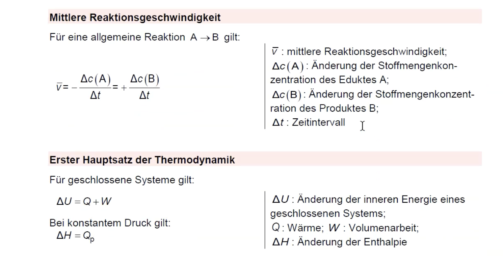
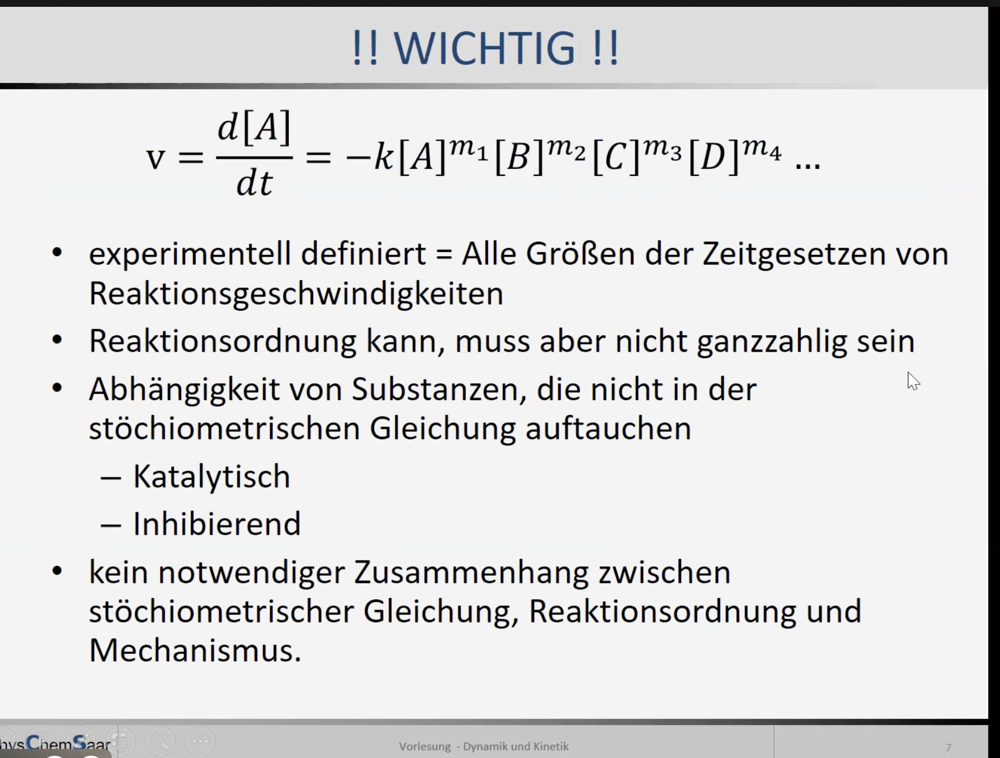
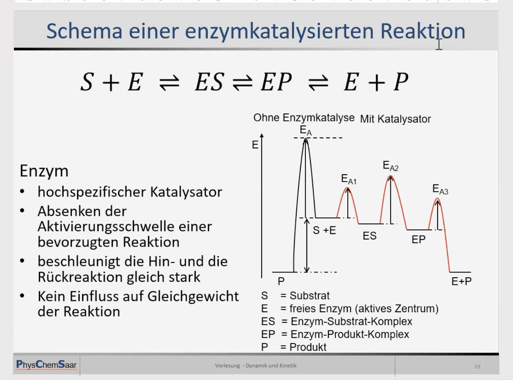

# Kinetik

Radioaktiver Zerfall

pro 10 Grad verdoppelt sich die Reaktionsgeschwindigkeit

## Siehe auch

- [[Thermodynamik]]
- [[Säuren & Basen]]
- [[PH und pOH - Werte]]
- [[Radioatkiver Zerfall]]
