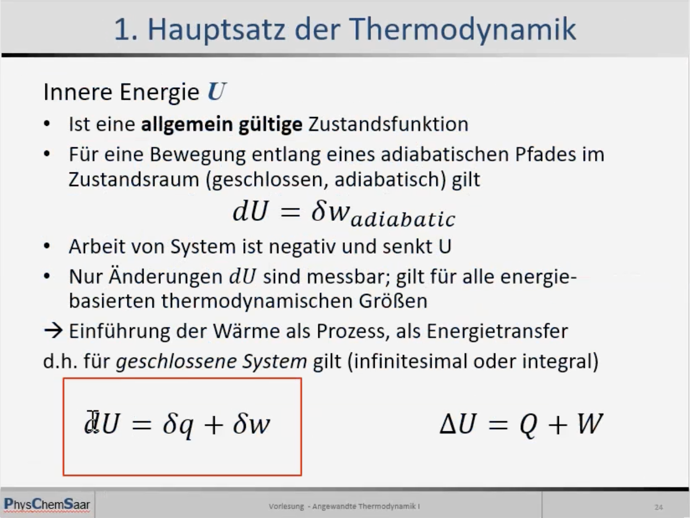
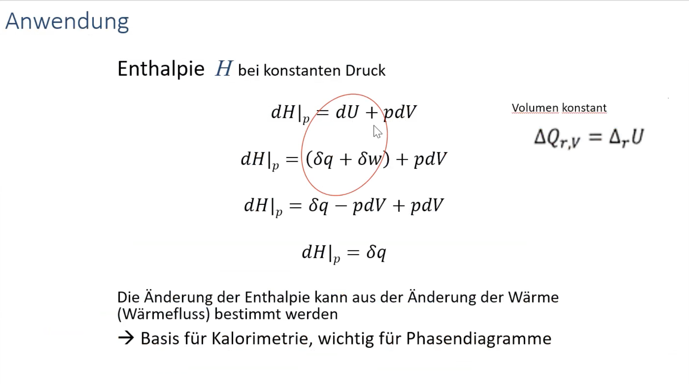
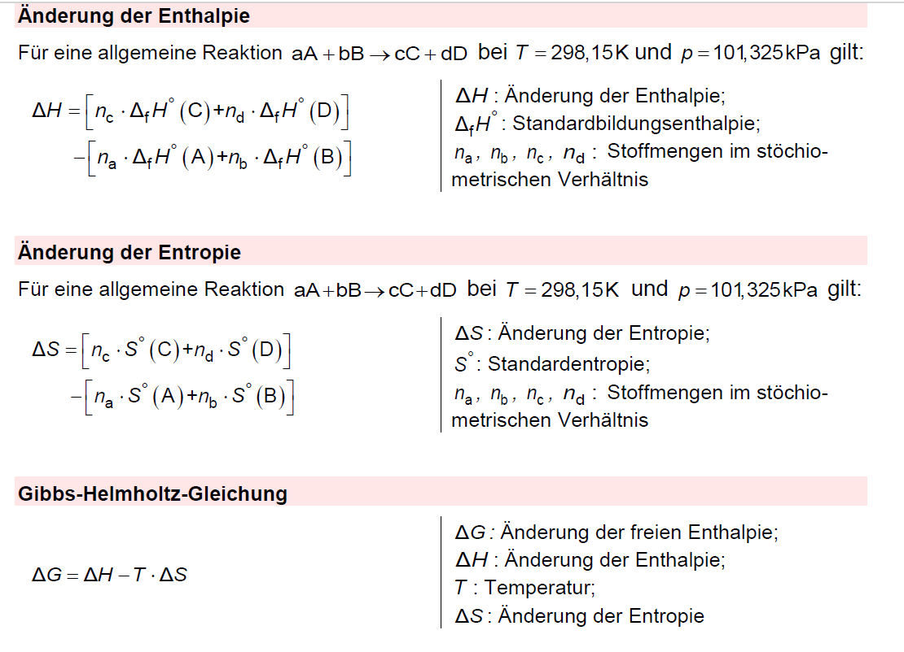
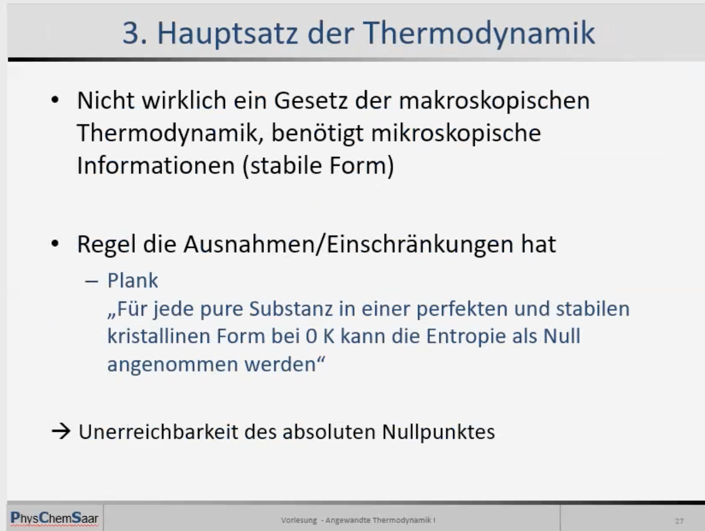
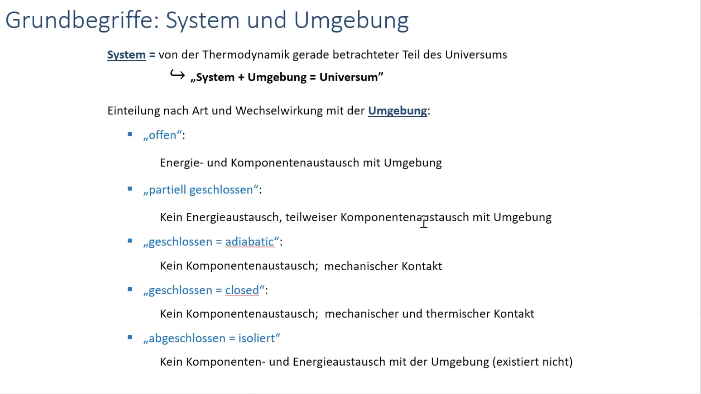

# Thermodynamik

### 1. Hauptsatz

Die Summe der Arbeit und Wärme, die ein System mit seiner Umgebung austauscht, ist gleich der Veränderung der inneren Energie des Systems.
Kein Perpetum Mobile erster Art; Keine Energie aus dem Nichts

dU=dQ+dW

### 2. Haupsatz

Wenn die Entropie eines geschlossenen Systems zu einem bestimmten Zeitpunkt einen bestimmten Wert hat und danach Zustandsänderungen eintreten, bleibt die Entropie konstant, wenn es sich um reversible Zustandsänderungen handelt, aber sie steigt, wenn die Zustandsänderung nur einen einzigen irreversiblen Schritt umfasst.

## Anwendung - Enthalpie

### 3. Hauptsatz

# Grundbegriffe  : System und Umgebung

