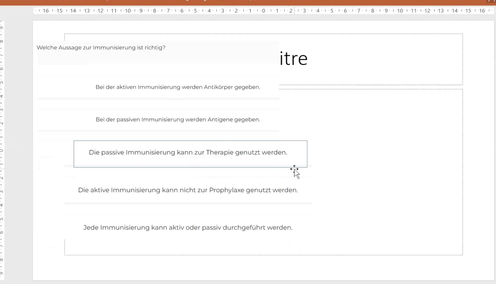
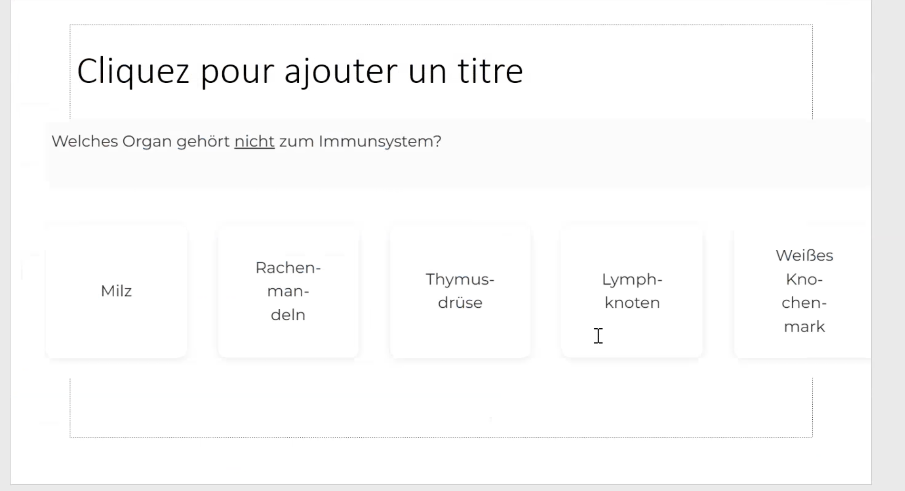
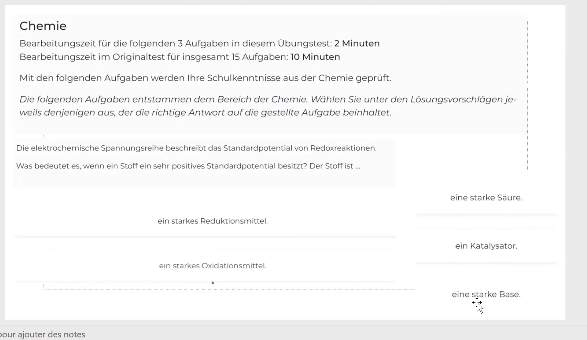
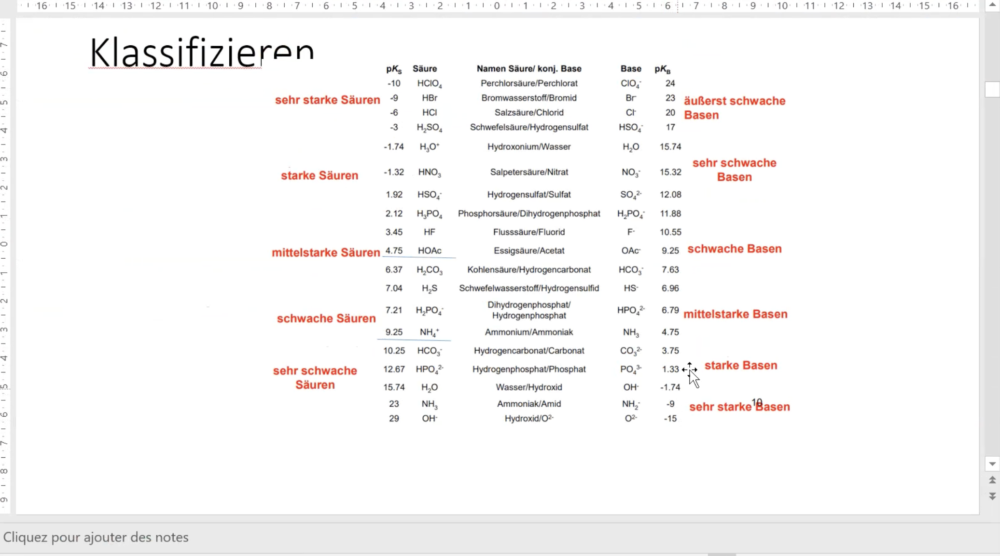
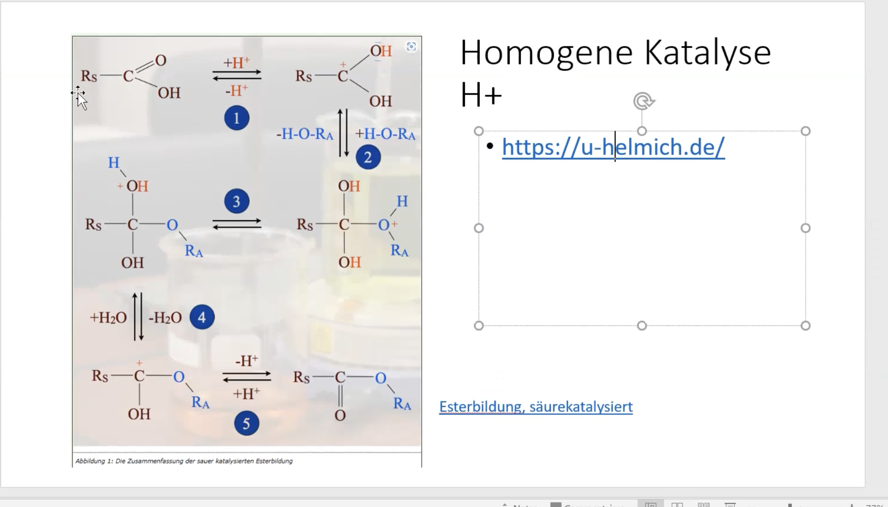
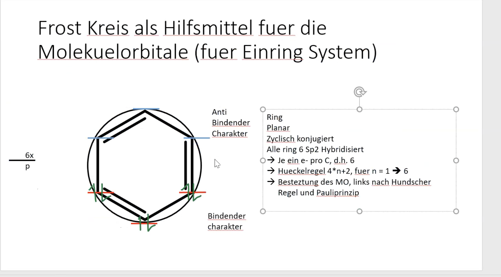
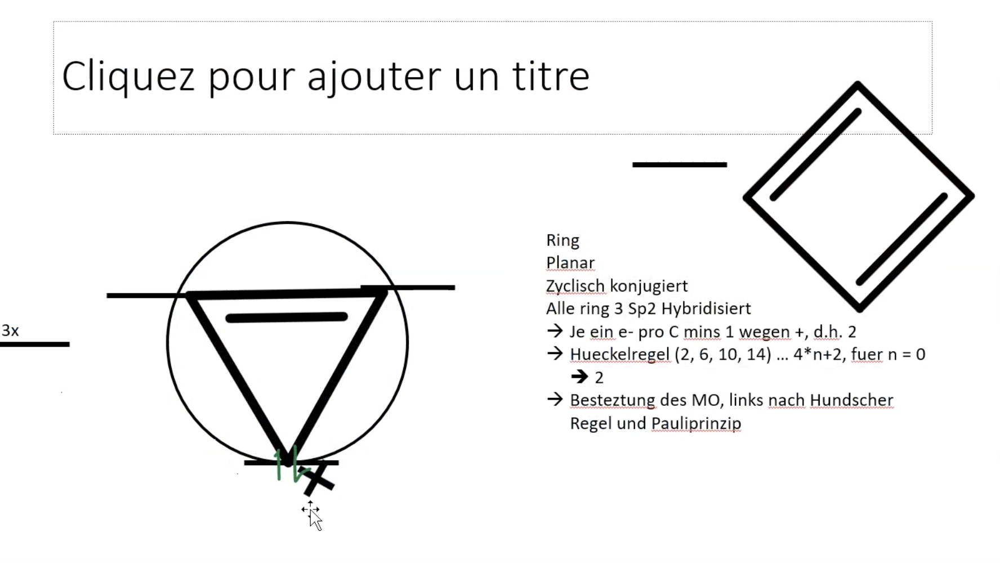

# Pharmacy

[🪁Studium Anmeldung](Studium Anmeldung.md)

[🎚️PhaST](PhaST/index.md)

[🚀Das PSE](Das PSE/index.md)

[🌜Stabile Elemente & OktettRegel](Stabile Elemente & OktettRegel.md)

[🏜️Alkane & Alkine](Alkane & Alkine.md)

[♦️Orbital Modell](Orbital Modell/index.md)

[🏢PH und pOH - Werte](PH und pOH - Werte/index.md)

[🫕Säuren & Basen](Säuren & Basen.md)

[🎄ElektroChemie](ElektroChemie/index.md)

[🔎Stöchiometrie](Stöchiometrie.md)

[🪜Kinetik](Kinetik/index.md)

[📉Radioatkiver Zerfall](Radioatkiver Zerfall.md)

[🍀Bio Chemie](Bio Chemie/index.md)

[📗Molekulare Strukturen](Molekulare Strukturen.md)

[🛰️Atommodelle](Atommodelle/index.md)

Alle Säure Base paare von OxoSäuren wissen

zucker + amino säuren

D und L NomenKlatur

R und S Nomenklatur

[🌄Thermodynamik](Thermodynamik/index.md)

[📠Herzkreislauf](Herzkreislauf.md)

[🎇Merkzettel](Merkzettel.md)

[🧭 AC Übung - VSEPR & Bindungstyp](AC Übung - VSEPR & Bindungstyp.md)

// Next time :

- Testfrage Bogen prüfen

- Biologie Wissen vergleichen

- Elektro Chemie Basics

Säure Katalysierte Veresterung

